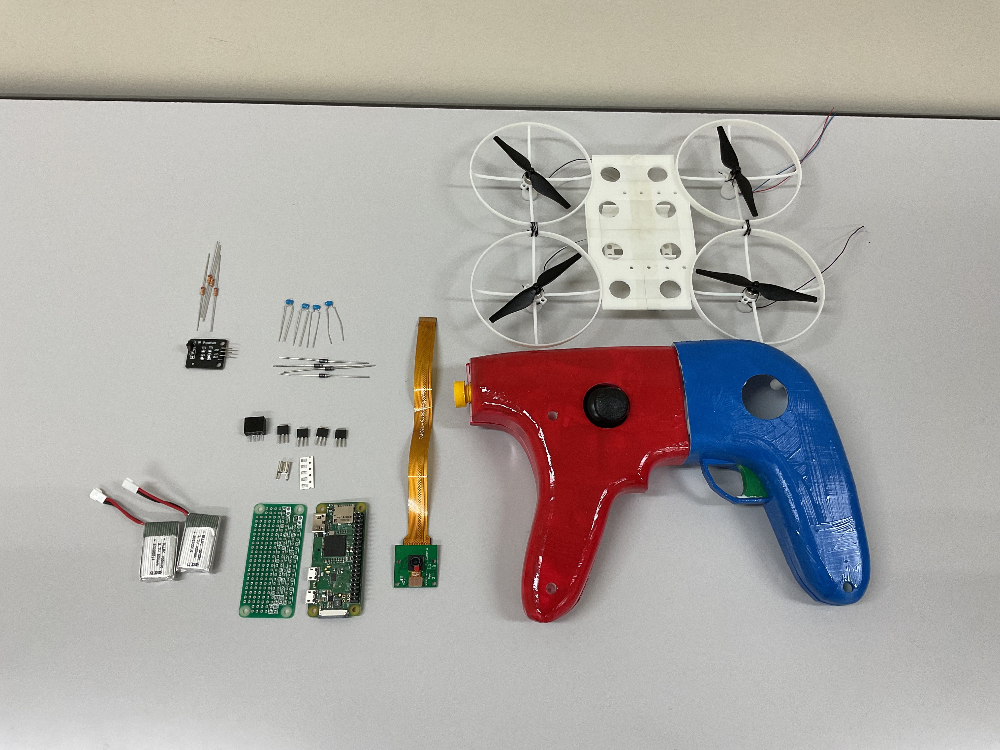
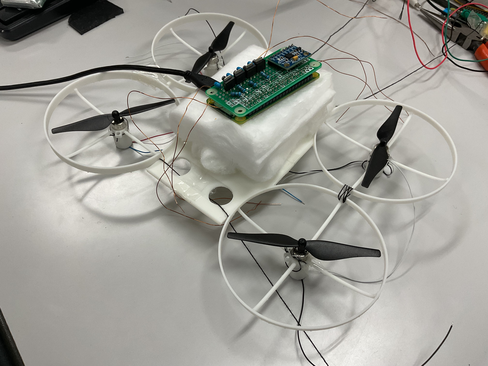
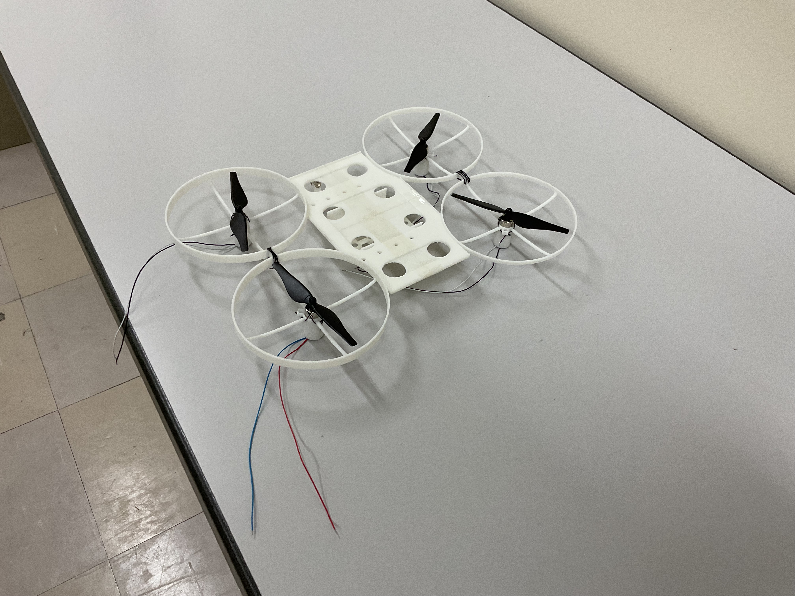
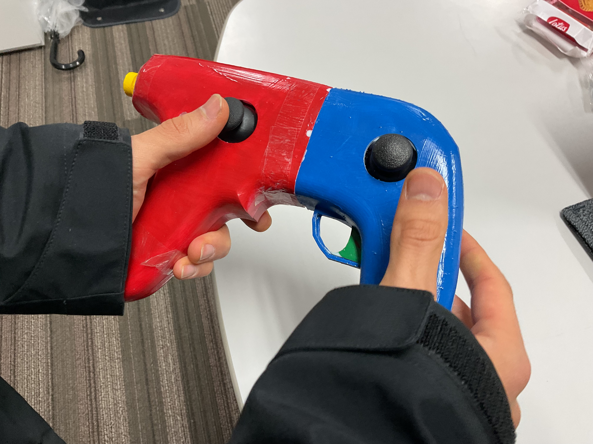
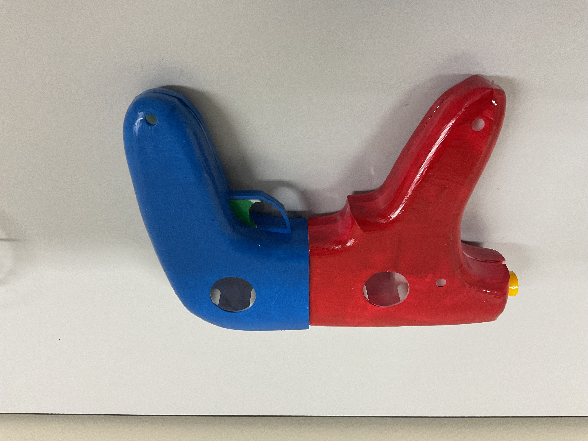
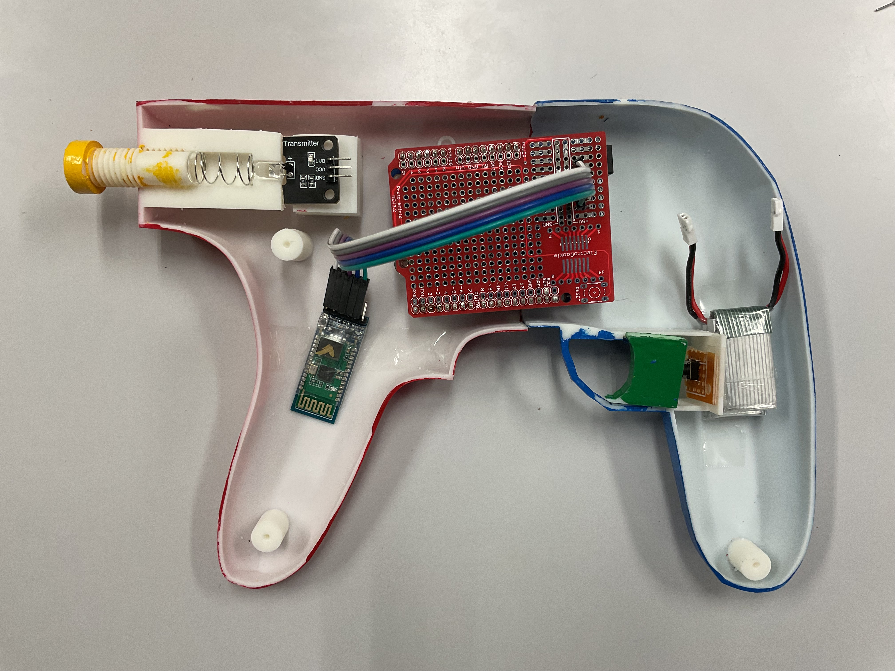
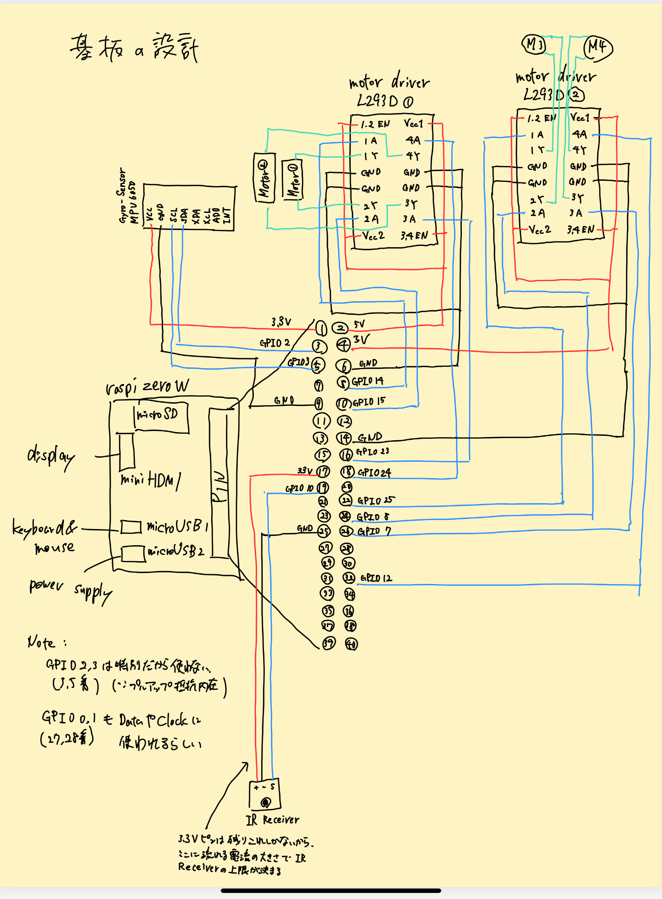
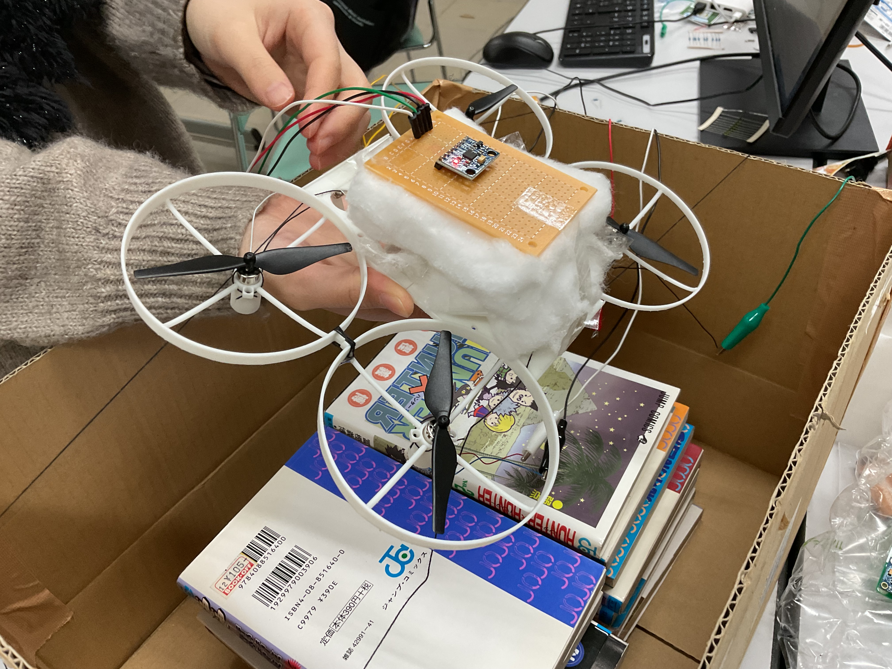
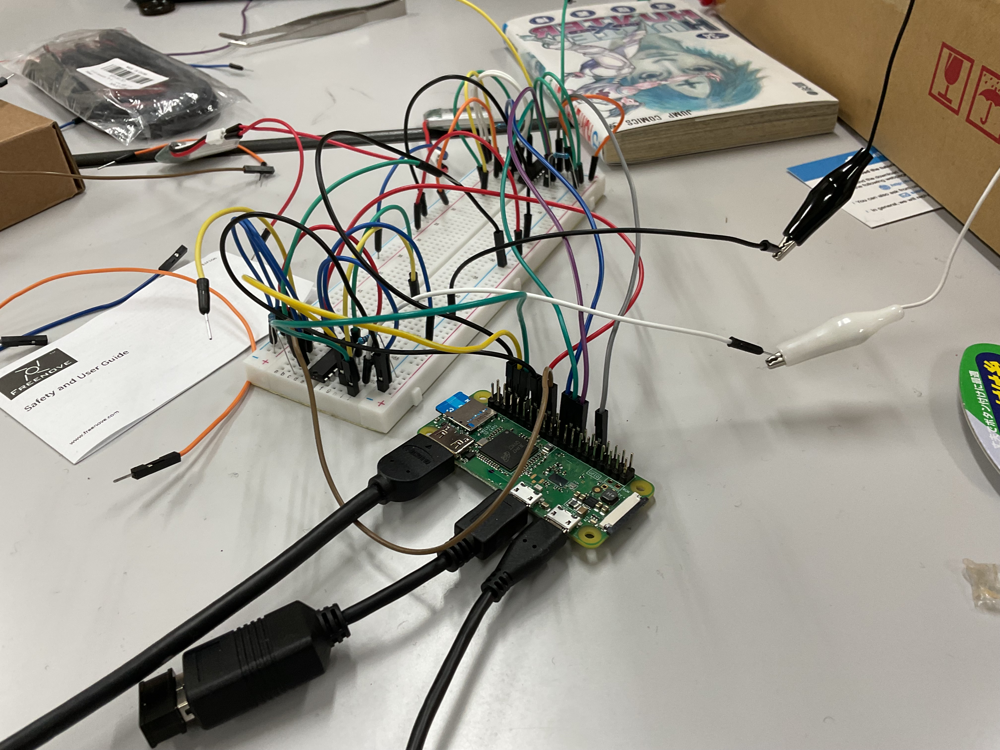
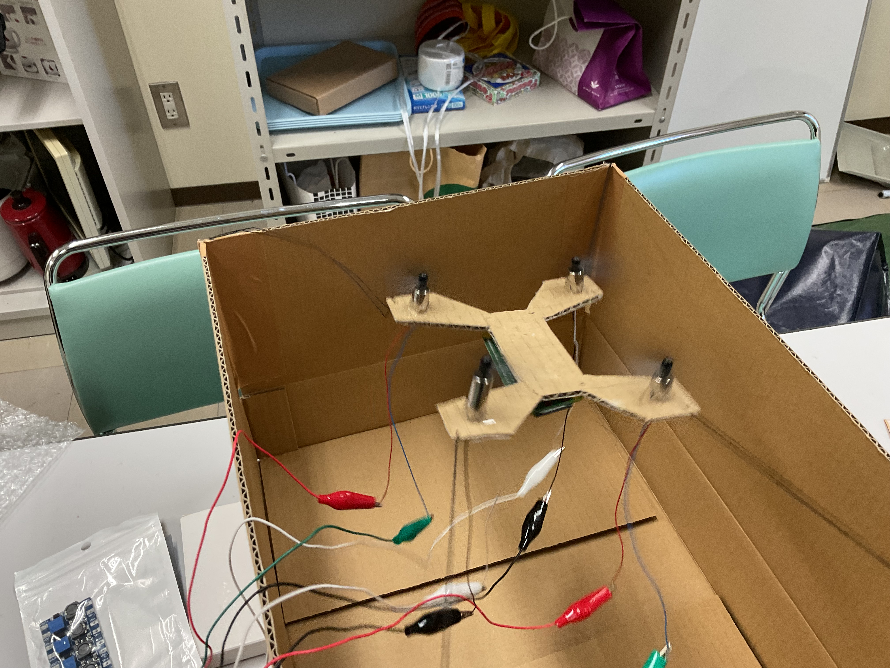

# Drone-CHISATO

Shooting Drone Kit: Including Custom Circuitry & Control🛠️, Real-Time Object Detection🎯, Trained Visual Recognition🧠, 3D-Printed Toy Integration🕹️

## Drone Controling Test

* https://youtu.be/rNhSv-Ze6aE

## Kit Overview

## Drone 

## Guntroller

## Circuit Design

## Experiment

